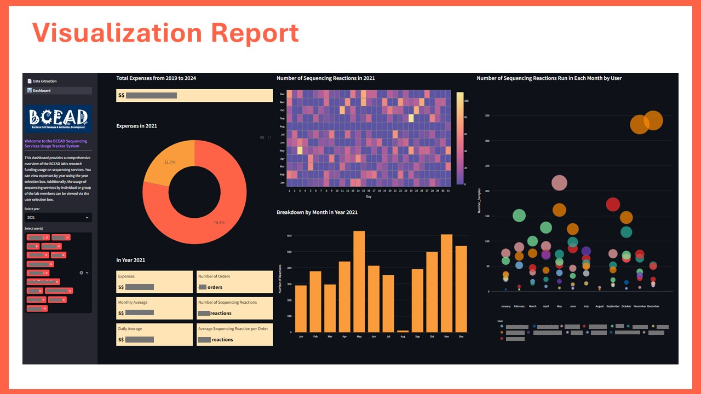

## Automated Tracking System for Sequencing Services in Research Laboratory

### Background

Created using Python programming, this web application automates record-keeping and tracking of Sanger sequencing services usage within a research laboratory. The application features a secure login page to restrict access to authenticated users. Monthly financial data is seamlessly updated by uploading statements of account (SoA) directly into the application, where automated ETL processes ensure efficient data processing. Visual reports are automatically generated, enhancing data analysis and facilitating informed decision-making.

👉 Web application: <a href>https://shihjen-sequencing-service-usage-tracker-system-app-0e17pz.streamlit.app/?embed_options=dark_theme</a> 

### Visualization Report

